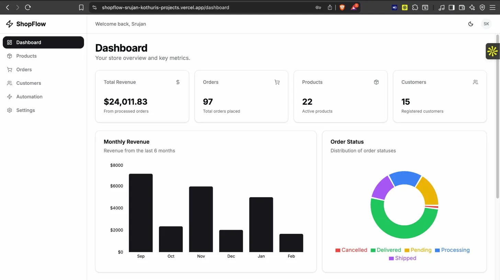
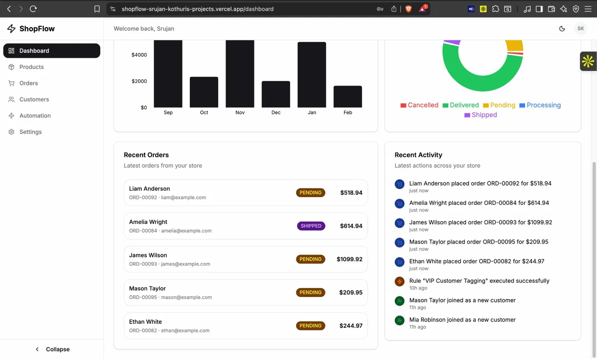
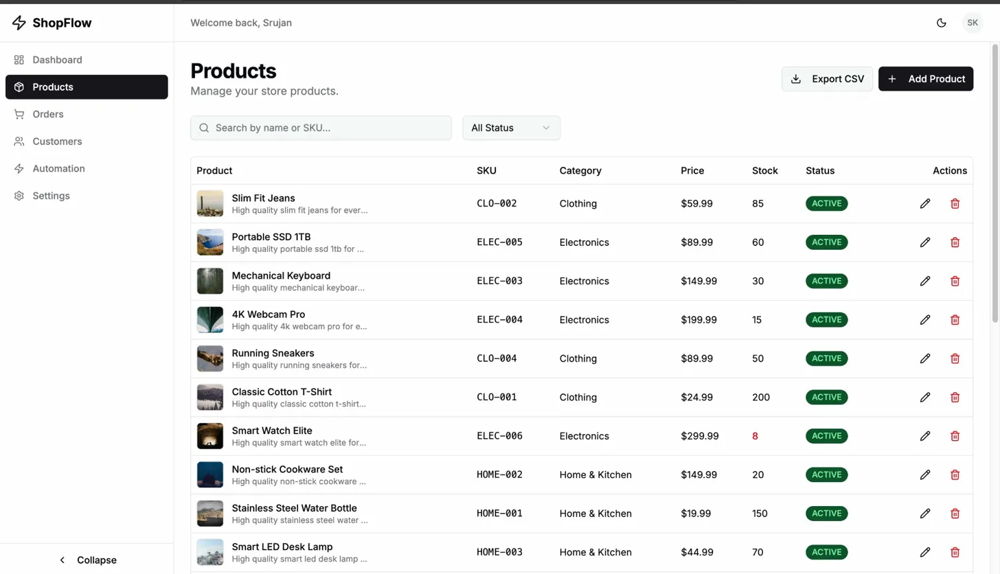
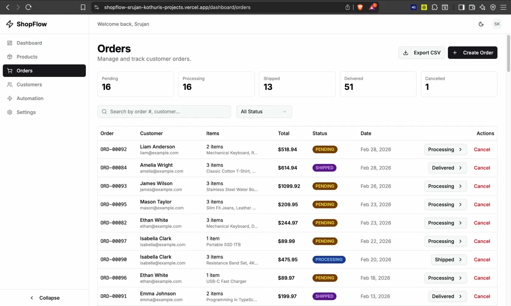
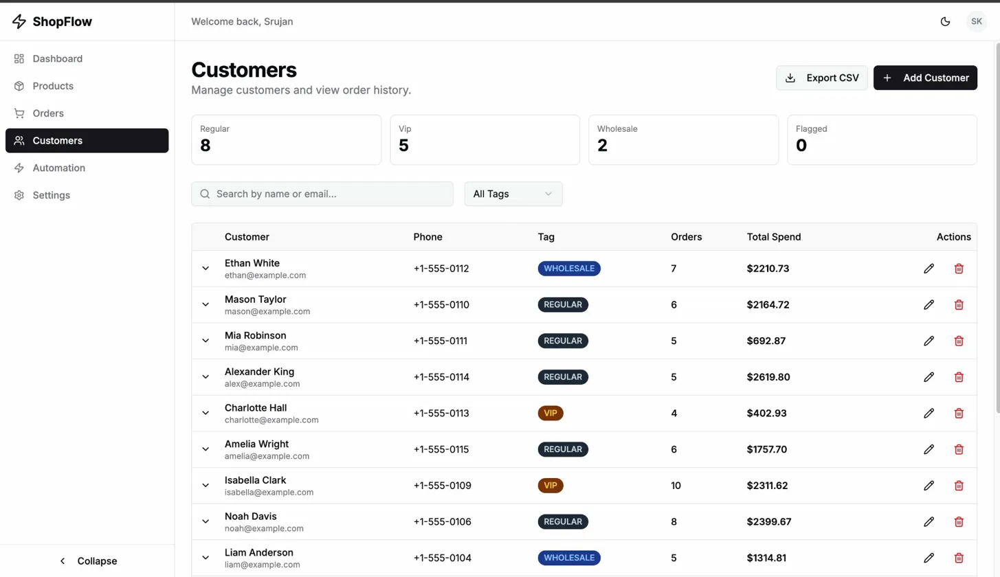
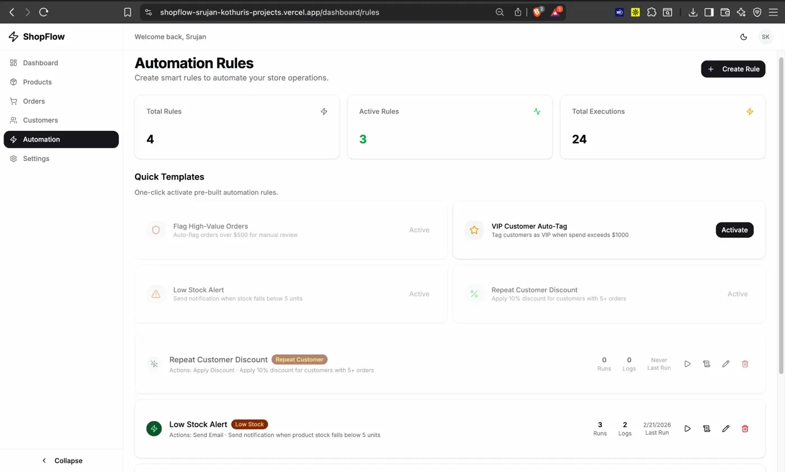
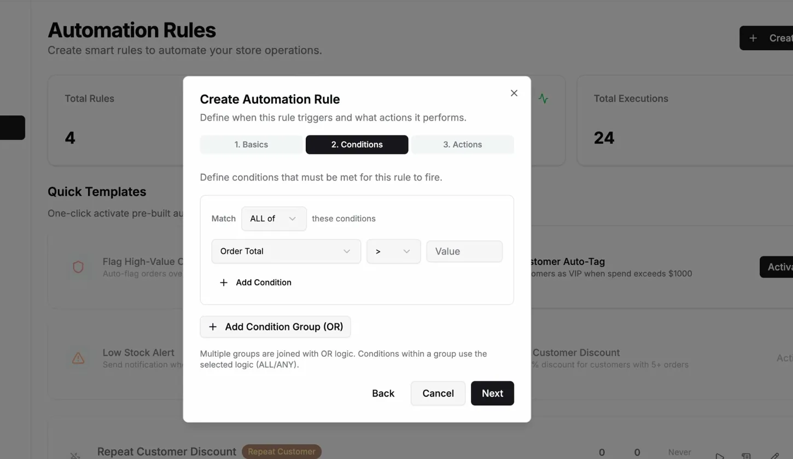
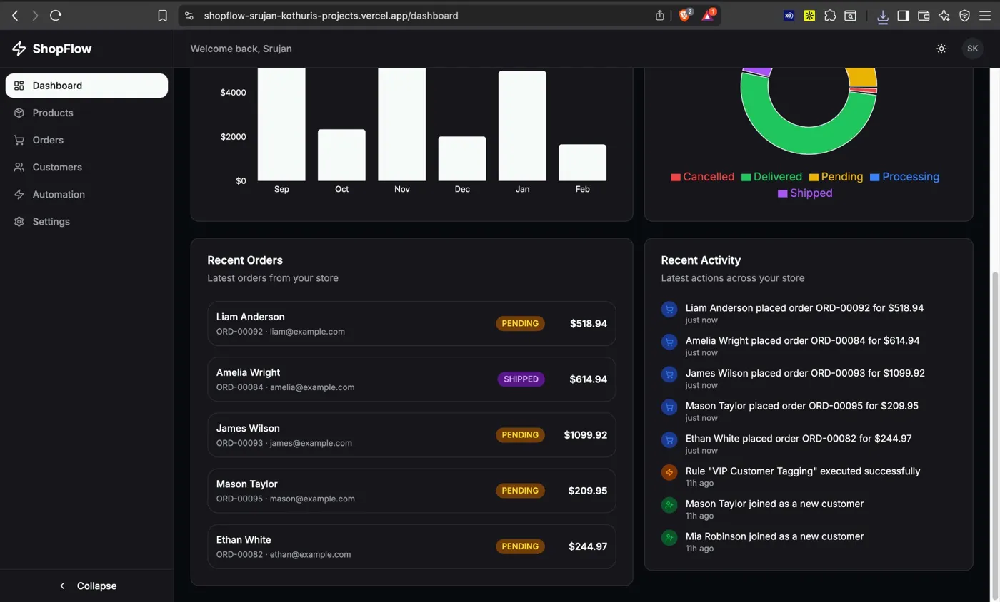

<p align="center">
  
</p>

<h1 align="center">⚡ ShopFlow</h1>

<p align="center">
  <strong>E-Commerce Operations Hub with Smart Automation Rules Engine</strong>
</p>

<p align="center">
  <a href="https://shopflow-srujan-kothuris-projects.vercel.app/">🔗 Live Demo</a> •
  <a href="#features">Features</a> •
  <a href="#tech-stack">Tech Stack</a> •
  <a href="#getting-started">Getting Started</a> •
  <a href="#architecture">Architecture</a>
</p>

<p align="center">
  
  
  
  
  
  
</p>

---

## 🎯 What is ShopFlow?

ShopFlow is a **full-stack e-commerce admin dashboard** that goes beyond basic CRUD. It features a **visual automation rules engine** that lets store owners create IF/THEN rules to automate operations — like flagging high-value orders, auto-tagging VIP customers, applying discounts, and sending notifications.

> **Demo Credentials:** `admin@shopflow.com` / `admin123`

---

## ✨ Features

### 📊 Analytics Dashboard
Real-time overview with revenue charts, order status distribution, key metrics, recent orders, and an activity feed — all powered by server-side Prisma aggregations.




### 📦 Product Management
Full CRUD with image previews, category management, SKU tracking, stock alerts (highlighted in red when low), status management (Active/Draft/Archived), search, and CSV export.



### 🛒 Order Management
Complete order pipeline with status progression (Pending → Processing → Shipped → Delivered), one-click status updates, order creation dialog with live total calculation, and CSV export.



### 👥 Customer Management
Customer profiles with expandable inline order history, total spend tracking, tag system (Regular/VIP/Wholesale/Flagged), and CSV export.



### 🚀 Automation Rules Engine (USP)
The standout feature — a **visual rule builder** with:
- **5 Trigger Types:** Order Placed, Status Changed, Low Stock, High Value Order, Repeat Customer
- **Nested AND/OR Conditions:** Build complex condition trees with multiple groups
- **5 Action Types:** Send Email, Tag Customer, Flag Order, Update Status, Apply Discount
- **One-Click Templates:** Pre-built rules for common scenarios
- **Rule Execution Engine:** Evaluates rules against live data in real-time
- **Full Audit Log:** Every execution logged with trigger data, actions performed, timestamps, and success/failure status
- **Test Mode:** Manually test rules against the latest order data



<details>
<summary>📸 Rule Builder Wizard</summary>

</details>

### 🌙 Dark Mode
Full dark/light theme toggle with smooth transitions across all components.



### 📱 Responsive Design
Mobile-friendly with a collapsible sidebar and hamburger menu.

### 🔐 Authentication
Email/password registration + Google OAuth with session management via Auth.js v5 (JWT strategy).

---

## 🏗 Architecture

```
┌──────────────────────────────────────────────────────────────┐
│                     FRONTEND                                  │
│  Next.js 16 (App Router) • TypeScript • Tailwind • shadcn/ui │
│                                                                │
│  ┌──────────┐ ┌──────────┐ ┌──────────┐ ┌──────────┐         │
│  │Dashboard │ │Products  │ │ Orders   │ │Customers │         │
│  │Analytics │ │  CRUD    │ │Pipeline  │ │ History  │         │
│  └──────────┘ └──────────┘ └──────────┘ └──────────┘         │
│  ┌─────────────────────────────────────────────────┐          │
│  │        Automation Rules Visual Builder           │          │
│  │   Triggers → Conditions (AND/OR) → Actions       │          │
│  └─────────────────────────────────────────────────┘          │
├──────────────────────────────────────────────────────────────┤
│                      API LAYER                                │
│  Next.js API Routes (RESTful)                                 │
│  /products • /orders • /customers • /categories               │
│  /rules • /rules/[id]/execute • /rules/[id]/logs • /export   │
├──────────────────────────────────────────────────────────────┤
│                  RULE EXECUTION ENGINE                         │
│  ┌───────────────┐    ┌──────────────┐    ┌──────────────┐   │
│  │   Condition    │───▶│    Action     │───▶│  Audit Log   │   │
│  │   Evaluator    │    │   Executor    │    │  (RuleLog)   │   │
│  │ (AND/OR tree)  │    │ (DB + Email)  │    │              │   │
│  └───────────────┘    └──────────────┘    └──────────────┘   │
├──────────────────────────────────────────────────────────────┤
│                     DATABASE                                  │
│  PostgreSQL (Neon) + Prisma 7 ORM                             │
│  8 Tables: User, Product, Category, Order, OrderItem,        │
│            Customer, Rule, RuleLog                             │
└──────────────────────────────────────────────────────────────┘
```

---

## 🛠 Tech Stack

| Category | Technology |
|----------|-----------|
| **Framework** | Next.js 16 (App Router, Server Components) |
| **Language** | TypeScript (end-to-end type safety) |
| **Database** | PostgreSQL via Neon (serverless) |
| **ORM** | Prisma 7 with Neon adapter |
| **Authentication** | Auth.js v5 (Credentials + Google OAuth) |
| **UI Components** | shadcn/ui + Tailwind CSS v4 |
| **Charts** | Recharts (Bar, Pie, Responsive) |
| **Rule Engine** | Custom-built JSON condition tree evaluator |
| **Email** | Resend (with simulation fallback) |
| **Deployment** | Vercel (frontend) + Neon (database) |
| **Containerization** | Docker + Docker Compose |

---

## 🚀 Getting Started

### Prerequisites
- Node.js 18+
- PostgreSQL database ([Neon](https://neon.tech) free tier recommended)

### Installation

```bash
# Clone the repository
git clone https://github.com/srujankothuri/shopflow.git
cd shopflow

# Install dependencies
npm install

# Set up environment variables
cp .env.example .env
# Edit .env with your credentials

# Generate Prisma client and push schema
npx prisma generate
npx prisma db push

# Seed with demo data (22 products, 15 customers, 96 orders, 4 rules)
npx prisma db seed

# Start development server
npm run dev
```

### Environment Variables

```env
DATABASE_URL="postgresql://..."        # Neon connection string
AUTH_SECRET="..."                       # Generate with: npx auth secret
AUTH_URL="http://localhost:3000"        # Your app URL
AUTH_GOOGLE_ID=""                       # Google OAuth (optional)
AUTH_GOOGLE_SECRET=""                   # Google OAuth (optional)
RESEND_API_KEY=""                       # For email actions (optional)
```

### Docker

```bash
docker-compose up
```

---

## 📁 Project Structure

```
src/
├── app/
│   ├── (auth)/                  # Auth pages (no sidebar layout)
│   │   ├── login/
│   │   └── register/
│   ├── (dashboard)/             # Dashboard layout (with sidebar)
│   │   └── dashboard/
│   │       ├── products/        # Products CRUD page
│   │       ├── orders/          # Orders management page
│   │       ├── customers/       # Customers page with history
│   │       ├── rules/           # Automation rules page
│   │       └── settings/        # Settings page
│   └── api/                     # REST API endpoints
│       ├── products/[id]/
│       ├── orders/[id]/
│       ├── customers/[id]/
│       ├── categories/
│       ├── rules/[id]/
│       │   ├── execute/         # Manual rule testing
│       │   └── logs/            # Rule execution logs
│       ├── export/              # CSV export endpoint
│       └── register/
├── components/
│   ├── dashboard/               # Stats cards, charts, activity feed
│   ├── products/                # Product dialog
│   ├── orders/                  # Order creation dialog
│   ├── customers/               # Customer dialog
│   ├── rules/                   # Rule builder, logs viewer, templates
│   ├── layout/                  # Sidebar, header
│   ├── providers/               # Auth + theme providers
│   └── ui/                      # shadcn/ui primitives
└── lib/
    ├── auth.ts                  # NextAuth configuration
    ├── db.ts                    # Prisma client singleton
    ├── dashboard.ts             # Dashboard aggregation queries
    ├── rule-engine.ts           # Rule evaluation + execution engine
    ├── email.ts                 # Resend email integration
    └── utils.ts                 # Utility functions
```

---

## 🔧 How the Rules Engine Works

```
Event Occurs (e.g., Order Placed)
         │
         ▼
┌─────────────────────┐
│  Fetch Active Rules  │  ← Filter by trigger type, sort by priority
│  for this Trigger    │
└─────────┬───────────┘
          │
          ▼
┌─────────────────────┐
│  Evaluate Conditions │  ← AND/OR tree evaluation against event data
│  (per rule)          │
└─────────┬───────────┘
          │
    ┌─────┴─────┐
    │           │
 PASS        FAIL
    │           │
    ▼           ▼
┌────────┐  ┌────────┐
│Execute │  │  Log   │
│Actions │  │SKIPPED │
└───┬────┘  └────────┘
    │
    ▼
┌─────────────────────┐
│  Log Execution       │  ← Status, actions run, trigger data snapshot
│  (Audit Trail)       │
└─────────────────────┘
```

1. **User creates a rule** via the 3-step visual wizard (trigger → conditions → actions)
2. **Rule is stored** as JSON in PostgreSQL (conditions as nested AND/OR tree, actions as array)
3. **When an event occurs** (e.g., order created via API), the engine fetches all active rules for that trigger
4. **Conditions are evaluated** using a recursive tree evaluator supporting AND/OR logic across groups
5. **If conditions pass**, actions execute sequentially (DB updates, customer tagging, email notifications)
6. **Every execution is logged** with full context — trigger data snapshot, actions performed, timestamps, success/failure

---

## 📝 Key Design Decisions

| Decision | Rationale |
|----------|-----------|
| **JSON conditions over relational tables** | Flexible nested AND/OR groups without complex self-referencing joins |
| **JWT sessions over DB sessions** | Faster auth checks, no extra database table needed |
| **Server Components for dashboard** | Stats computed server-side with Prisma aggregations — zero client-side data fetching on initial load |
| **Event-driven rule execution** | Rules fire on API events (order creation); easily extensible to webhooks and cron triggers |
| **Audit trail for every execution** | Production-grade observability — debug failed rules, track automation history |
| **CSV export via API route** | Stream large datasets without loading everything into browser memory |
| **Simulation mode for emails** | App works without Resend API key; emails log to console in dev |

---

## 🤝 Contributing

```bash
# Fork the repo
# Create your feature branch
git checkout -b feature/amazing-feature

# Commit your changes
git commit -m "feat: add amazing feature"

# Push to the branch
git push origin feature/amazing-feature

# Open a Pull Request
```

---

## 👤 Author

**Venkata Srujan Kothuri**

- 🌐 GitHub: [@srujankothuri](https://github.com/srujankothuri)
- 💼 LinkedIn: [srujankothuri](https://linkedin.com/in/srujankothuri)
- 📧 Email: srujan019@gmail.com

---

## 📄 License

This project is open source under the [MIT License](LICENSE).

---

<p align="center">
  Built with ❤️ using Next.js, Prisma, and TypeScript
</p>
